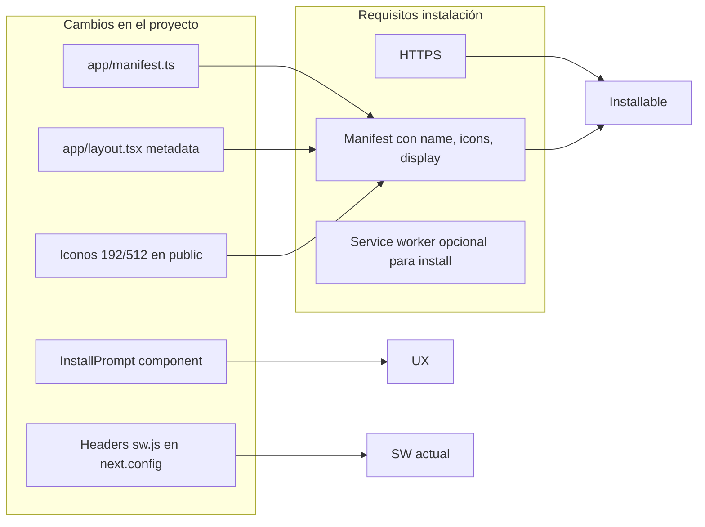

# Plan PWA instalable en móviles

Este documento describe el plan para lograr una versión instalable en dispositivos móviles (PWA). Quien implemente la PWA debe usar esta guía.

## Situación actual

- **Stack**: Next.js 14 (App Router), React 18, Supabase.
- **Service worker**: Ya existe [public/sw.js](../public/sw.js) para notificaciones push (eventos `push` y `notificationclick`), y se registra en [components/notifications/push-subscribe-button.tsx](../components/notifications/push-subscribe-button.tsx) al suscribirse.
- **Carece de**: manifest PWA, viewport/theme-color en metadata, iconos en tamaños PWA (192/512) e indicaciones para "Añadir a la pantalla de inicio".

Para que la app sea **instalable** en móviles (Android Chrome, Safari iOS) solo hace falta cumplir requisitos PWA: **HTTPS** + **manifest válido** con iconos. El soporte offline es opcional y no es necesario para la instalación.

---

## Enfoque: PWA nativa (sin tiendas)

Se seguirá la [guía oficial de Next.js para PWAs](https://nextjs.org/docs/app/building-your-application/configuring/progressive-web-apps): manifest con convención de Next.js, metadata en el layout y un componente de instalación. No se usará `next-pwa`; el manifest se define en `app/manifest.ts` y el SW actual se mantiene.

---

## Pasos de implementación

### 1. Manifest PWA

- Crear **`app/manifest.ts`** (convención de Next.js; se sirve como `/manifest.webmanifest` o similar y se enlaza automáticamente).
- Incluir: `name`, `short_name` (ej. "Presupuesto"), `description`, `start_url: '/'`, `display: 'standalone'`, `background_color`, `theme_color`, e `icons` con al menos:
  - `sizes: "192x192"`, `type: "image/png"`
  - `sizes: "512x512"`, `type: "image/png"`
- Las rutas de iconos apuntarán a archivos en `public/` (por ejemplo `/icon-192x192.png`, `/icon-512x512.png`).

### 2. Iconos PWA

- Añadir en **`public/`**:
  - `icon-192x192.png`
  - `icon-512x512.png`
- Si no existe un logo/icono de la app, se pueden generar a partir de un favicon o diseño simple (herramientas: [PWABuilder Image Generator](https://www.pwabuilder.com/imageGenerator), [RealFaviconGenerator](https://realfavicongenerator.net/)), o usar placeholders temporales para poder probar la instalación.
- Opcional: `apple-touch-icon` (ej. 180x180) para iOS; puede ser el mismo asset que el de 192px.

### 3. Metadata y viewport en el layout

- En [app/layout.tsx](../app/layout.tsx), ampliar `metadata`:
  - **Viewport**: `width=device-width, initial-scale=1, maximum-scale=1, viewport-fit=cover` (viewport-fit útil en iOS con notch).
  - **theme-color**: mismo valor que en el manifest (ej. color primario de la app) para la barra de estado.
- No hace falta enlazar el manifest a mano si usas `app/manifest.ts`; Next.js lo expone y los navegadores lo descubren.

### 4. Componente de instalación (InstallPrompt)

- Crear un componente cliente (ej. **`components/pwa/install-prompt.tsx`**) que:
  - Use `window.matchMedia('(display-mode: standalone)')` para no mostrar nada si ya está instalado.
  - En **iOS**: detectar con `navigator.userAgent` (iPad/iPhone/iPod) y mostrar un mensaje breve: "Para instalar: botón Compartir y luego 'Añadir a la pantalla de inicio'".
  - En **Android**: opcionalmente escuchar `beforeinstallprompt`, guardar el evento y mostrar un botón "Instalar app" que llame a `prompt()`; si no se implementa, Chrome mostrará su propio banner cuando se cumplan los criterios.
- Integrar este componente en un lugar visible pero no intrusivo (por ejemplo un banner colapsable en el layout, o en la página de notificaciones/ajustes). Evitar mostrarlo en cada página si se prefiere una sola aparición (ej. solo en dashboard o en configuración).

### 5. Headers del service worker

- En [next.config.mjs](../next.config.mjs), añadir `headers` para `/sw.js`:
  - `Content-Type: application/javascript; charset=utf-8`
  - `Cache-Control: no-cache, no-store, must-revalidate`
- Así el navegador no cachea en exceso el SW y las actualizaciones se reparten antes.

### 6. Comportamiento del SW actual

- [public/sw.js](../public/sw.js) no necesita cambios para la instalación: solo push y `notificationclick`. La instalación en móviles depende del manifest y de HTTPS, no de que el SW haga caching.
- Si más adelante se quiere soporte offline, se podría extender el SW o usar algo como Serwist; queda fuera de este plan.

### 7. Comprobaciones

- Probar en **Android** (Chrome): después de desplegar con HTTPS, comprobar que aparece "Añadir a la pantalla de inicio" o el banner de instalación.
- Probar en **iOS** (Safari): comprobar que el manifest se carga y que las instrucciones del InstallPrompt son correctas (Compartir → Añadir a la pantalla de inicio).
- Desarrollo local: la instalación suele requerir HTTPS; para pruebas locales se puede usar `next dev --experimental-https` según la doc de Next.js.

---

## Resumen de archivos

Archivos que la implementación creará o modificará:

| Acción    | Archivo                                                                                                    |
| --------- | ---------------------------------------------------------------------------------------------------------- |
| Crear     | `app/manifest.ts`                                                                                          |
| Crear     | `public/icon-192x192.png`, `public/icon-512x512.png` (o generados)                                         |
| Crear     | `components/pwa/install-prompt.tsx`                                                                        |
| Modificar | `app/layout.tsx` (viewport, themeColor, y opcionalmente incluir InstallPrompt o un wrapper que lo muestre) |
| Modificar | `next.config.mjs` (headers para `sw.js`)                                                                   |

---

## Opcional / Fase posterior

- **App en tiendas (Capacitor)**: empaquetar el build de Next.js en un WebView con Capacitor para publicar en Google Play / App Store; implica configuración de proyectos nativos, firma y políticas de las tiendas. No es necesario para "instalable en móviles" vía PWA.
- **beforeinstallprompt** en Android: mejora la UX con un botón "Instalar" propio; no obligatorio para que la app sea instalable.
- **Soporte offline**: cachear rutas o datos con el SW (p. ej. Serwist) en una fase posterior si se desea.
